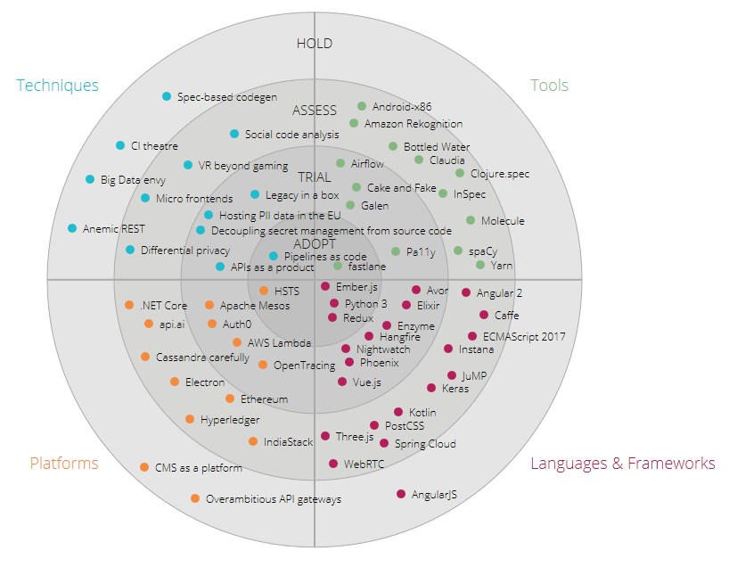

[](https://travis-ci.org/raman-nbg/techradar)

# Techradar
This is another version of the ThoughtWorks technolgoy radar (https://www.thoughtworks.com/radar).



This techradar has the goal that each company/department can create its own visualization of the trends to be focused on.
To maintain the content of the techradar this one provides the possibility to dynamically add and edit the blips on the radar.

To use this radar you have to implement a class which provides the data for the radar.

## Getting Started
This radar is written in ECMAScript 6.

### Prerequisites
To compile and run this application you have to install [npm/Node.js](https://www.npmjs.com/get-npm?utm_source=house&utm_medium=homepage&utm_campaign=free%20orgs&utm_term=Install%20npm).

After you installed Node.js you have to download and install all dependencies. For that just run the following command in the root folder of this repository:
```
npm install
```

### Transpile/Compile
To run the techradar in a common browser you have to transpile the ES6 code to ES5 which can be executed by browsers. For that just run the following command in the root folder of this repository.
```
npm run build
```
You can find the result in the subfolder `dist`.

### Usage
The techradar provides the class `Radar` which have to be used to render the radar. The Radar constructor need three arguments.
- The identifier of an HTML element which should contain the radar (like an ID).
- An instance of an object which provides the data for the radar and handles the add and update events.
- OPTIONAL: Options for the radar.

```javascript
import Radar from './../src/Radar';
import DummyRadarDataProvider from './DummyRadarDataProvider';

var radarOptions = {
	canvasWidth : 1300,
	enableMove : true,
	enableAddNew : true
}

var radarDataProvider = new DummyRadarDataProvider();
var radar = new Radar("#techradarContainer", radarDataProvider, radarOptions);
radar.render();
```

### Options
There are several options which can be provided. This snippet shows all available options with their default values.
```javascript
var radarOptions = {
    
    //Width of the canvas
    canvasWidth: 600,

    //Height of the canvas
    canvasHeight: 600,

    //The margins of the canvas
    margin: { top: 20, right: 20, bottom: 20, left: 20 },

    //What is the max value of the radius
    maxRadius: 1,

    //The size of the colored circles of each blip
    dotRadius: 5,

    //The color of the strokes between the states
    radarColorStrokes : "#AAAAAA",

    //The color of the state labels
    radarStateLabelColor : "#222222",

    //Enable adding new blips
    enableAddNew : false,

    //Enable moving existing blips
    enableMove : false,

    //The opacity of all blips on hovering a blip
    blipHoverOpacity : 0.35,
}
```

### Implementation of the Data Provider
The radar data provider has to implement 4 methods (load, updateItem, addItem, getMetaData). The first three methods must return a [promise-object](https://developer.mozilla.org/en-US/docs/Web/JavaScript/Reference/Global_Objects/Promise) for an asynchronous execution.

A sample implementation can be found in [DummyRadarDataProvider.js](sample/DummyRadarDataProvider.js)

#### load
A fullfiled promise has to provide an array which contains all items that should be rendered. This means that you should use this method to query the data from your data source.
```javascript
export default class DummyRadarDataProvider {
    load() {
        return new Promise(function(resolve, reject) {
            var data = ...;
            resolve(data);
        });
    }

    ...
}
```
The items structure must have the following scheme:
```json
{
  "items": {
    "properties": {
      "angle": {
        "type": "integer"
      }, 
      "id": {
        "type": "integer"
      }, 
      "label": {
        "type": "string"
      }, 
      "link": {
        "type": "string"
      }, 
      "radius": {
        "type": "integer"
      }
    }, 
    "type": "object"
  }, 
  "type": "array"
}
```
Each item has a label which will be shown next to the blip on the UI. To determine the position of an item it has to contain polar coordinates (radius and angle). Optional a link (URI) can be set for the item. If a link is specified the user can click on a blip to get forwarded to the specified URI.

#### updateItem
If you enable updating items you have to implement the updateItem method
```javascript
export default class DummyRadarDataProvider {
    ...

    updateItem(item) {
        return new Promise(function(resolve, reject) {
            ... //save item
            resolve(item);
        })
    }

    ...
}
```
The argument `item` contains the one element of the data-array which should be updated. In this method you should save the item in the underlying data source. The fullfiled promise have to provide the save item again.

#### addItem
If you enable adding new items you have to implement the addItem method
```javascript
export default class DummyRadarDataProvider {
    ...

    addItem(radius, angle) {
        return new Promise(function(resolve, reject) {
            var label = prompt("Please enter the label of the new blip:", "");
            if (label === null || label === "") {
                reject();
            } else {
                var newItem = ... //save new item
                resolve(newItem);
            }
        });
    }

    ...
}
```
The addItem method gets two arguments to specify the position of the blip. The radius and the angle.

In this sample implementation the method shows a prompt to ask the user for a label. Any other implementation is also possible. As you can see the addItem operation can be canceled by invoking `reject()`.

#### getMetaData
This method will be invoked once on creating the radar. It has to provide the four quadrants and the different states.

The structure of the return value must be the following scheme:
```json
{
  "properties": {
    "quadrants": {
      "items": {
        "properties": {
          "color": {
            "properties": {
              "blip": {
                "type": "string"
              }, 
              "text": {
                "type": "string"
              }
            }, 
            "type": "object"
          }, 
          "id": {
            "type": "integer"
          }, 
          "name": {
            "type": "string"
          }
        }, 
        "type": "object"
      }, 
      "type": "array"
    }, 
    "states": {
      "items": {
        "properties": {
          "backgroundColor": {
            "type": "string"
          }, 
          "id": {
            "type": "integer"
          }, 
          "name": {
            "type": "string"
          }
        }, 
        "type": "object"
      }, 
      "type": "array"
    },
    "movements": {
      "items": {
        "properties": {
          "id": {
            "type": "integer"
          },
          "description": {
            "type": "string"
          },
          "blipIcon": {
            "type": "string",
            "enum": ["circle", "circle-filled", "rectangle"]
          }
        }
      }
    }
  }, 
  "type": "object"
}
```